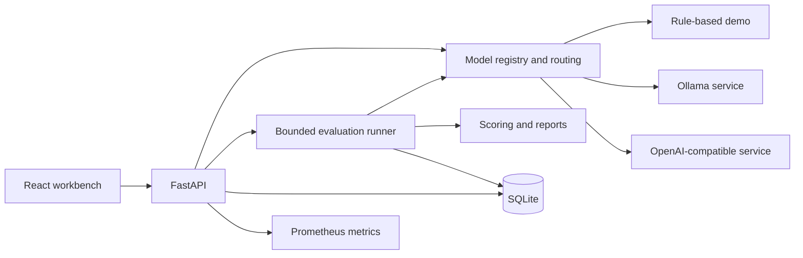

# ModelOps Lab

**A model serving and evaluation workbench for manufacturing tickets.** Register model endpoints, extract structured fields, classify issues, compare batch results, and trace individual requests.

[中文](README.md) · [Deployment](docs/DEPLOYMENT.md) · [Evaluation methodology](docs/EVALUATION.md) · [Data card](docs/DATA_CARD.md) · [API guide](docs/API.md) · [Validation notes](docs/VALIDATION.md) · [Contributing](CONTRIBUTING.md)

This is an independently implemented open-source project. All bundled tickets are synthetic; no internal company code, customer records, or private documents are included. Default demo providers are **deterministic rule-based programs**, not LLMs. Their scores and timings demonstrate the workflow and must not be presented as real model performance.

## Features

- Model registry with service version, endpoint, inference parameters, health checks, and a default model.
- Unified non-streaming inference through Demo, Ollama, and OpenAI-compatible adapters.
- Nine-field ticket schema with explicit null handling and four issue categories.
- 160 synthetic tickets, split into 96 development and 64 test records; JSON import/export and dataset hashes.
- Bounded asynchronous evaluation, multiple models, configurable concurrency, cancellation, and persisted progress.
- Field accuracy, category accuracy, macro-F1, confusion matrices, success/valid-output rates, latency quantiles, and throughput.
- Per-request results plus Markdown, JSON, and CSV reports.
- Request logs, API-process CPU/memory measurements, and Prometheus metrics.
- Demo fault injection for timeouts, malformed output, provider errors, and deterministic output noise.
- SQLite persistence, optional Bearer access key, explicit upstream host allowlist, Docker Compose, and CI.

Model registration connects an **already running inference service**. The application does not download weights, deploy GPU workloads, or operate manufacturing equipment.

## Quick start

Clone the project and enter its directory:

```bash
git clone https://github.com/TruncateCorn117/modelops-lab.git
cd modelops-lab
```

### Docker Compose

```bash
docker compose up --build -d
```

Open [http://localhost:8000](http://localhost:8000). The first start initializes demo providers and the synthetic dataset. The demo requires no GPU, model downloads, or upstream API key; building the image requires internet access for dependencies.

```bash
docker compose logs -f modelops
docker compose down
```

Data persists in the `modelops-data` volume. Normal `down` preserves it; `down -v` deletes it. The container runs as a non-root user and publishes port 8000 on localhost only. See the [deployment guide](docs/DEPLOYMENT.md) for networked deployments.

### Local development

Requirements: Python 3.11+, Node.js 22, and pnpm 10.17.1. On macOS/Linux:

```bash
python3 -m venv .venv
source .venv/bin/activate
python -m pip install -r requirements.lock.txt
python -m pip install --no-deps -e .
cd frontend
corepack enable
corepack prepare pnpm@10.17.1 --activate
pnpm install --frozen-lockfile
pnpm build
cd ..
uvicorn modelops.main:app --host 127.0.0.1 --port 8000 --workers 1
```

On Windows, activate the virtual environment using `.venv\Scripts\Activate.ps1`. Open [the app](http://localhost:8000) or [interactive API docs](http://localhost:8000/docs). For frontend development, run `pnpm dev` inside `frontend/` in a second terminal; the Vite server proxies API requests to port 8000.

## Suggested demo

1. Check a demo provider's health in the model registry.
2. Submit the ticket below in the playground and inspect its output, timing, and request ID.
3. Evaluate both demo providers on 12 test samples, then inspect individual errors and download a report.
4. Create a demo model with timeout or invalid-JSON fault mode, invoke it, and find the failure in request logs.
5. Connect a real provider and repeat the experiment with a separate report.

```text
设备编号：EQ-301；设备：贴标机；产线：3号产线；报告日期：2025-03-12；
故障码：E17；现象：光电传感器信号间歇丢失；
处理措施：重新固定传感器接线端子；停机时长：18分钟
```

The expected category is `electrical`; missing fields are `null`, and explicit no-downtime statements map to integer `0`. The UI and bundled task data are primarily Chinese.

## Real model connections

For Ollama, start a local service and register provider `ollama`, base URL `http://127.0.0.1:11434`, and the exact model name shown by `ollama list`. For an OpenAI-compatible service, use provider `openai` and its API base, for example `http://127.0.0.1:8001/v1`.

When running the app in Docker, use `host.docker.internal` to reach a host service; its listener must be reachable from the container. Remote hosts must be explicitly included in `MODEL_OPS_ALLOWED_HOSTS`. For provider authentication, configure a server environment variable and put only its **name** in `api_key_env`.

Ollama uses `/api/chat`; compatible services must support Chat Completions with JSON Schema through `response_format`. This is a limited non-streaming adapter contract, not a guarantee of compatibility with every provider. No format fallback or automatic retry is performed. Health checks do not prove extraction quality. Details: [deployment and troubleshooting](docs/DEPLOYMENT.md).

## Architecture



The backend runs as one process/worker. Evaluations execute in-process and persist completed results to SQLite. On restart, unfinished evaluations become `interrupted`; they are not automatically replayed. Each run snapshots model configuration, sample selection, prompt version, dataset hash, and evaluation settings. See [architecture](docs/ARCHITECTURE.md).

## Understanding the metrics

Field accuracy uses normalized exact matches over eight extraction fields, including explicit null values; category is scored separately. Failed requests score zero across every field and category. Macro-F1 averages all four fixed classes; a class with no reference or prediction contributes zero.

Successful output must pass the complete JSON schema, so success rate and valid-output rate share the same acceptance boundary in v0.1. P50/P95 use successful request latency through output validation, excluding the gateway's global concurrency wait. Throughput includes completed failures and uses measured wall-clock duration. No streaming or time-to-first-token measurement is implemented.

Models execute sequentially within a run, with configurable concurrency inside each model. No automatic warmup is performed. CPU/memory measurements cover **the API process**, not the model server or GPU. Demo latency and synthetic-data accuracy cannot establish real LLM capability or production readiness.

The bundled dataset uses shared templates, explicit fields, and some explicit category labels. It is suited to workflow checks, not a rigorous independent industrial benchmark. See [data limitations](docs/DATA_CARD.md) and [metric definitions](docs/EVALUATION.md).

## Verification

```bash
python -m pytest -q
python scripts/generate_dataset.py
git diff --exit-code -- data/manufacturing_tickets.json
cd frontend
pnpm build
```

CI runs backend tests on Python 3.11/3.12, verifies deterministic dataset generation, and builds the frontend. Automated tests do not require a GPU or paid provider. Real-model quality, latency, and compatibility must be verified in the target environment; the project does not claim unmeasured benchmark results.

A full-platform check with local Ollama + Qwen2.5 0.5B completed 16 tickets through each of two protocols: 32 real calls, all with valid structured output, 89.06% exact field matches, and 56.25% category matches. The errors are retained in the [raw report](docs/examples/real-integration-report.md). These are two interfaces to the same small model, not independent models or a production benchmark; see [validation conditions](docs/VALIDATION.md).

With the full application running, execute `python scripts/smoke_test.py --samples 16` to evaluate the two demo providers and export Markdown, JSON, and CSV files to `runtime/reports/`. Use `--url` for a different server and set `MODEL_OPS_API_KEY` in the script's environment when platform authentication is enabled.

## Scope and license

This release targets local development and trusted small-team evaluation. It does not implement multi-tenancy, RBAC, a distributed task queue, automatic model deployment, GPU scheduling, streaming, retries, or production audit controls. Do not run multiple workers or replicas against the same runtime directory.

Ticket text, expected answers, parsed output, and experiment history persist in SQLite without automatic retention or redaction. See [security and data handling](SECURITY.md) before importing private data.

Code and bundled synthetic data are released under the [MIT License](LICENSE). External model weights and providers retain their own licenses and terms.
