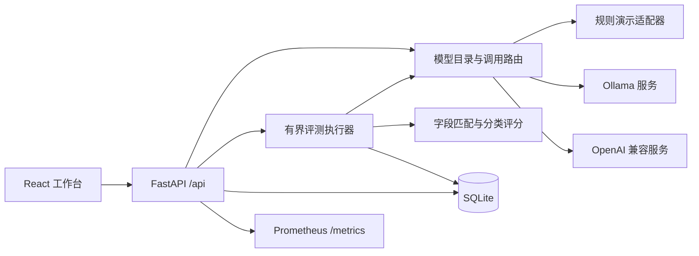

# ModelOps Lab

**面向制造业工单处理的模型服务与评测平台。** 将模型登记、工单字段提取、四类故障分类、批量评测和请求追踪放在同一个工作台中。

[English](README.en.md) · [部署与模型接入](docs/DEPLOYMENT.md) · [评测方法](docs/EVALUATION.md) · [数据卡](docs/DATA_CARD.md) · [API 指南](docs/API.md) · [验证记录](docs/VALIDATION.md) · [贡献指南](CONTRIBUTING.md)

这是个人独立实现的开源工程项目。仓库只包含自行设计的合成工单，不包含企业内部代码、工单、服务地址或客户材料。默认演示模型是**确定性的规则程序**；演示指标用于验证系统流程，不代表任何大模型的真实能力。

## 第一版可以做什么

| 工作流 | 已实现能力 |
| --- | --- |
| 模型中心 | 登记、编辑、删除模型服务；版本与推理参数；健康检查；选择默认模型 |
| 工单体验台 | 统一调用 Demo / Ollama / OpenAI 兼容服务；结构化输出；请求编号、延迟、错误反馈 |
| 数据集 | 内置 160 条合成工单；dev/test 拆分；JSON 导入导出；版本与内容摘要 |
| 评测实验室 | 多模型对比；可配置并发和样本数；进度、取消；逐条结果与字段差异 |
| 测试报告 | 字段准确率、分类准确率、宏平均 F1、格式合格率、成功率、P50/P95 延迟；Markdown / JSON / CSV 下载 |
| 运行观测 | 请求日志、错误类型、API 进程 CPU/内存、Prometheus 指标、历史趋势 |
| 故障演示 | 规则服务可模拟超时、错误 JSON、上游错误及错误字段，用于验证错误处理 |
| 工程交付 | SQLite 持久化、可选访问密钥、上游主机白名单、Docker Compose、自动测试与 CI |

模型登记接入的是**已经运行的推理服务**。第一版不自动下载模型或调度 GPU，也不直接控制制造设备。

## 快速启动

先克隆项目并进入目录：

```bash
git clone https://github.com/TruncateCorn117/modelops-lab.git
cd modelops-lab
```

### 方式一：Docker Compose

需要 Docker 和 Compose。项目目录中执行：

```bash
docker compose up --build -d
```

访问 [http://localhost:8000](http://localhost:8000)，第一次启动会初始化演示模型和合成数据集。演示流程不需要 GPU、模型下载或上游 API 密钥。首次镜像构建需要联网下载依赖。

```bash
docker compose logs -f modelops
docker compose down
```

SQLite 数据保存在 `modelops-data` 卷中；普通 `down` 保留数据。不要在希望保留历史记录时使用 `down -v`。容器以普通用户运行，默认只向本机开放 8000 端口。

### 方式二：本地开发

需要 Python 3.11+、Node.js 22 和 pnpm 10.17.1。以下命令适用于 macOS/Linux：

```bash
python3 -m venv .venv
source .venv/bin/activate
python -m pip install -r requirements.lock.txt
python -m pip install --no-deps -e .
```

构建前端：

```bash
cd frontend
corepack enable
corepack prepare pnpm@10.17.1 --activate
pnpm install --frozen-lockfile
pnpm build
cd ..
```

启动完整应用：

```bash
uvicorn modelops.main:app --host 127.0.0.1 --port 8000 --workers 1
```

打开 [http://localhost:8000](http://localhost:8000)。接口文档位于 [/docs](http://localhost:8000/docs)。Windows 可使用 `.venv\Scripts\Activate.ps1` 激活环境。

开发时，可在另一个终端进入 `frontend/` 后运行 `pnpm dev`，访问其输出的地址；Vite 会将 `/api` 请求转发到本机 8000 端口。

## 五分钟演示

1. 在「模型中心」检查默认演示模型状态，明确其“模拟”标记。
2. 在「工单体验台」选择模型，提交下面的工单，检查结构化字段和请求记录。
3. 在「评测实验室」选择内置数据集、test 分组和两个演示模型，先用 12 条样本运行对比。
4. 打开实验详情，检查错误样本和分类混淆矩阵，下载 Markdown 报告。
5. 新建一个 Demo 服务并选择超时或格式错误故障，再做一次调用，从「请求日志」找到相同请求编号。
6. 接入真实模型后重复实验，保留独立报告，区分模拟结果与真实推理结果。

```text
现场维修记录
设备编号：EQ-301；设备：贴标机；产线：3号产线；报告日期：2025-03-12；
故障码：E17；现象：光电传感器信号间歇丢失；
处理措施：重新固定传感器接线端子；停机时长：18分钟
```

预期类别为 `electrical`，日期为 `2025-03-12`，停机时长为整数 `18`。缺失字段应为 `null`，明确未停机才是 `0`。

## 接入真实模型

先在本机或受控服务器启动模型服务，再在模型中心登记：

| 字段 | Ollama 示例 | OpenAI 兼容服务示例 |
| --- | --- | --- |
| provider | `ollama` | `openai` |
| base_url | `http://127.0.0.1:11434` | `http://127.0.0.1:8001/v1` |
| model_name | 与 `ollama list` 显示的名称一致 | 与服务的模型标识一致 |
| api_key_env | 本地无鉴权服务留空 | 例如 `MODEL_PROVIDER_API_KEY` |
| timeout_seconds | 按本机推理速度设置，例如 `120` | 例如 `60` |

容器访问宿主机服务时，将 `127.0.0.1` 改为 `host.docker.internal`。远端服务域名须由管理员加入 `MODEL_OPS_ALLOWED_HOSTS`。`api_key_env` 保存的是**环境变量名**，真实密钥只在服务器环境中配置。

Ollama 适配器使用 `/api/chat`，OpenAI 兼容适配器使用 `/chat/completions`，要求上游支持 `response_format` 的 JSON Schema 结构化输出。接口仅支持第一版定义的非流式文本任务；不自动降级格式要求或重试。完整步骤和连接故障排查见[部署文档](docs/DEPLOYMENT.md)。

## 架构



后端单进程运行。评测任务在进程内执行，结果持续写入 SQLite；服务重启时，未完成实验被标记为中断。模型配置、数据摘要、提示词版本和评测参数随实验保存，便于复核。详见[架构与边界](docs/ARCHITECTURE.md)。

## 评测结果怎么读

- **字段准确率**：8 个提取字段的规范化精确匹配率，分类单独计分；包含 `null` 匹配。
- **分类指标**：四个固定类别的准确率、宏平均 F1 和混淆矩阵。
- **成功率与格式合格率**：调用成功并通过结构校验的请求比例；第一版的两个数值采用同一验收边界。
- **P50/P95**：成功请求的适配器往返延迟，包含网络调用、输出解析和校验；不包含网关排队，不是首 token 延迟。
- **吞吐量**：完成请求数除以实验计时窗口，失败请求也计入完成数量。
- **资源指标**：只测 API 进程 CPU 和内存，不是模型服务器、GPU 或整机指标。

合成数据采用共享模板和可控字段，任务难度有限。精确匹配也可能惩罚语义相同的改写，因此不能把演示分数当作生产结论。完整定义及实测记录清单见[评测方法](docs/EVALUATION.md)。

## 测试与可复现性

```bash
python -m pytest -q
python scripts/generate_dataset.py
git diff --exit-code -- data/manufacturing_tickets.json
```

```bash
cd frontend
pnpm build
```

自动测试使用模拟网络与规则服务，不要求 GPU 或付费接口。CI 在 Python 3.11 / 3.12 下运行后端测试并构建前端。真实模型可用性、实际吞吐和生产数据效果需要在目标环境另行验证；仓库不宣称未经测量的性能结果。

已用本地 Ollama + Qwen2.5 0.5B 通过完整平台分别验证两个接口：每个接口 16 条工单，共 32 次真实推理，全部获得有效结构化输出；字段精确匹配 89.06%、分类匹配 56.25%，保留了实际错误。[查看原始报告](docs/examples/real-integration-report.md)和[验证条件](docs/VALIDATION.md)。这是同一小模型的两种接口验证，不能当作生产质量或性能基准。

完整应用启动后，可运行一次端到端演示检查：

```bash
python scripts/smoke_test.py --samples 16
```

脚本用两个规则服务执行 test 样本，并将 Markdown、JSON、CSV 报告保存到 `runtime/reports/`。使用 `--url` 指定其他地址；启用平台鉴权时在执行脚本的终端提供 `MODEL_OPS_API_KEY`。

## 项目结构

```text
backend/modelops/          API、存储、推理适配器、评测与报告
frontend/                 React + TypeScript 工作台
data/                     可公开的合成工单
tests/                    后端与推理/评分测试
scripts/generate_dataset.py 可复现的数据生成器
docs/                     架构、部署、API、评测和数据说明
.github/workflows/         持续集成
```

## 使用边界与后续方向

第一版面向本地演示和可信小团队评测。它尚未实现多租户权限、分布式任务队列、自动模型部署、GPU 调度、流式输出、自动重试或生产审计。不要启动多个 worker 或多个副本共享同一运行目录。请求原文及解析结果会保存到本地数据库；使用自己的数据前请了解[数据与安全说明](SECURITY.md)。

后续可扩展人工标注复核、字段级误差分析、流式首 token 延迟、版本回归门禁和外部指标采集。欢迎按[贡献指南](CONTRIBUTING.md)提交小而完整的改进。

代码与随仓库发布的合成数据采用 [MIT License](LICENSE)。外部模型权重和上游服务遵循各自许可与条款。
