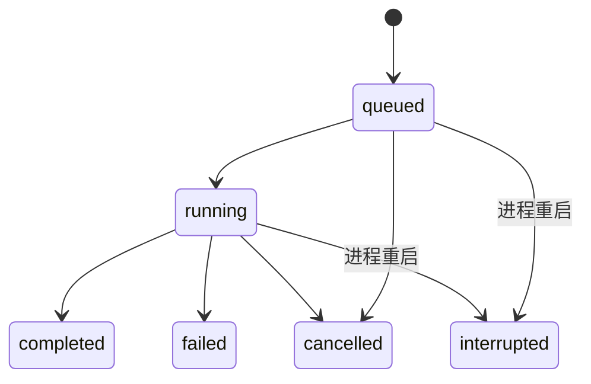

# 架构与实现边界

## 请求路径

1. React 工作台调用 `/api`，开发时由 Vite 代理，构建后由 FastAPI 提供静态资源。
2. FastAPI 校验入参、可选 Bearer 密钥、模型是否可用以及调用容量。
3. 服务层为调用分配请求编号，通过全局并发闸门后调用适配器。
4. 适配器完成服务请求和输出模式校验，返回结构化工单；错误转换成稳定的错误类型。
5. SQLite 保存调用元数据、工单原文与输出，Prometheus 累计请求和耗时指标。

输出模式共 9 个字段；缺失信息必须显式为 `null`，分类固定四类。提示词将工单当作输入数据，要求忽略其中试图修改输出行为的指令，但这不是对所有模型提示注入攻击的保证。

## 组件与取舍

| 组件 | 选择 | 第一版取舍 |
| --- | --- | --- |
| HTTP 服务 | FastAPI + Pydantic | 输入与输出边界清晰，可自动生成接口文档 |
| 存储 | SQLite / WAL | 零独立数据库服务，便于本地运行；不适合多副本写入 |
| 前端 | React + TypeScript + Vite | 管理与实验工作台，开发代理/生产同源 |
| 推理接入 | Demo / Ollama / OpenAI compatible | 少量明确适配器，统一字段与错误 |
| 执行器 | 进程内 asyncio 任务 | 部署简单；重启后中断，不自动恢复或重放 |
| 指标 | prometheus-client + psutil | 监控 API 进程与调用，不采集远端 GPU |

## 数据对象

- **Model**：一条“模型版本 + 服务地址 + 调用配置”的登记。第一版没有独立的权重仓库和服务实例层；同一模型的不同部署需要登记为不同记录。`version` 是使用者填写的标识，不会自动证明上游权重不变。
- **Dataset**：名称、来源、revision、行内容与规范 JSON SHA-256。每行包含原文、标准答案、唯一行 ID 和拆分。
- **Run**：模型与参数快照、数据摘要、选中行 ID、状态与逐模型汇总。评测读取创建时快照，活跃实验涉及的模型不能编辑或删除。
- **Request**：独立调用或实验中的一次调用。记录请求编号、模型、实验 ID、输入、结果、延迟及错误。实验请求还包含标准答案与字段评分。

四类对象以 SQLite JSON 文档保存；请求时间与实验关联建立索引。默认模型状态保存在模型记录中，切换默认不等于流量迁移、灰度发布或自动回滚。

## 并发与任务状态

全局最多 8 个同时执行的推理请求，最多 2 个活跃实验。单个实验并发可设为 1–8；多模型按顺序测试，每个模型内部按此并发执行。同一模型不能同时被两个实验占用；手动调用会共享全局容量。

取消后保留已完成结果；尚未完成的请求可能未写入日志。启动时把残留活跃实验标记为 `interrupted`，不自动重跑，以免意外重复消耗上游额度。已完成结果可以导出，但部分完成实验的分数不应与完整实验直接比较。

## 健康、资源与日志

后台定期检查启用模型，也支持手动检查。状态包含 `unknown`、`healthy` 和 `unavailable`，并附检查时间与详情。健康检查侧重服务可达与模型登记；它不检查工单字段准确率。

资源面板采样后端 API 进程的 CPU 和常驻内存；多核 CPU 百分比可能超过 100%。Prometheus `/metrics` 用于请求量、调用耗时和进程内存观测，数据随进程重启清零。SQLite 历史记录不随重启清空。

标准运行日志包含请求编号、模型编号、状态、延迟及错误类型，不输出密钥与工单正文。应用数据库另外保存工单原文和结构化结果用于追踪，**没有自动脱敏或自动过期删除**。详见[安全与数据说明](../SECURITY.md)。

## 明确不包含的能力

第一版不包含模型训练/微调、GPU 调度、自动服务拉起、分布式队列、多租户、RBAC、流式输出、自动重试、自动容灾、生产告警和标注审批。它是一个可运行的工程工作台，能提供系统测试与选型依据，不能代替制造设备控制系统或维修决策流程。
